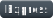

**Мой стек с примерами проектов:**
* Frontend:
  * 
[[Оно тебе надо]](https://github.com/Gittenhuben/ono-tebe-nado)&nbsp;
[[Сложно сосредоточиться]](https://github.com/Gittenhuben/slozhno-sosredotochitsya)&nbsp;
[[Закрывающий тег]](https://github.com/Gittenhuben/zakrivayuschiy-teg-f)
  * 
[[Оно тебе надо]](https://github.com/Gittenhuben/ono-tebe-nado)&nbsp;
[[Посмотри в окно]](https://github.com/Gittenhuben/posmotri_v_okno)&nbsp;
[[Сложно сосредоточиться]](https://github.com/Gittenhuben/slozhno-sosredotochitsya)&nbsp;
[[Закрывающий тег]](https://github.com/Gittenhuben/zakrivayuschiy-teg-f)
  * 
[[Mesto]](https://github.com/Gittenhuben/mesto-project-ff)
  * 
[[Веб Ларёк (Frontend)]](https://github.com/Gittenhuben/web-larek-frontend)
  * 
[[Blog Customizer]](https://github.com/Gittenhuben/blog-customizer)&nbsp;
[[Космическая бургерная]](https://github.com/Gittenhuben/stellar-burgers)
  * 
[[Космическая бургерная]](https://github.com/Gittenhuben/stellar-burgers)
* Backend:
  * 
[[Веб Ларёк (Backend)]](https://github.com/Gittenhuben/web-larek-express)&nbsp;
[[Веб Ларёк ("Плохой сервер")]](https://github.com/Gittenhuben/bad-server)
  * 
[[Film! (Backend)]](https://github.com/Gittenhuben/film-react-nest)
  * 
[[Film! (Backend)]](https://github.com/Gittenhuben/film-react-nest)&nbsp;
[[Веб Ларёк ("Плохой сервер")]](https://github.com/Gittenhuben/bad-server)
  * 
[[Film! (Backend)]](https://github.com/Gittenhuben/film-react-nest)&nbsp;
[[Веб Ларёк ("Плохой сервер")]](https://github.com/Gittenhuben/bad-server)
  * 
(основы, есть несколько микросайтов)
  * 
(Selenium, Socket, Requests, Concurrent.futures, есть работающий бэк с ML)
* СУБД:
  * 
[[Веб Ларёк (Backend)]](https://github.com/Gittenhuben/web-larek-express)&nbsp;
[[Film! (Backend)]](https://github.com/Gittenhuben/film-react-nest)&nbsp;
[[Веб Ларёк ("Плохой сервер")]](https://github.com/Gittenhuben/bad-server)
  * 
[[Film! (Backend)]](https://github.com/Gittenhuben/film-react-nest)
* Тестирование:
  * 
[[Космическая бургерная]](https://github.com/Gittenhuben/stellar-burgers)&nbsp;
[[Film! (Backend)]](https://github.com/Gittenhuben/film-react-nest)
  * 
[[Космическая бургерная]](https://github.com/Gittenhuben/stellar-burgers)
* Data Science:
  * 
(NumPy, Pandas, Scikit-learn, Keras)&nbsp;
[[DS projects]](https://github.com/Gittenhuben/DS)
* Прочее:
  * 
